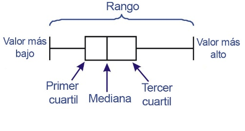

{width="5.902777777777778in"
height="3.972916666666667in"}

# Contenido {#contenido .TOC-Heading .unnumbered}

[Modulo 2 [3](#modulo-2)](#modulo-2)

[¿Qué es machine learning?
[3](#qué-es-machine-learning)](#qué-es-machine-learning)

[Problemas empresariales resueltos con machine learning
[4](#problemas-empresariales-resueltos-con-machine-learning)](#problemas-empresariales-resueltos-con-machine-learning)

[Proceso de machine learning
[6](#proceso-de-machine-learning)](#proceso-de-machine-learning)

[Información general de herramientas de ML
[7](#información-general-de-herramientas-de-ml)](#información-general-de-herramientas-de-ml)

[Infraestructura y marcos de trabajo de ML
[8](#infraestructura-y-marcos-de-trabajo-de-ml)](#infraestructura-y-marcos-de-trabajo-de-ml)

[Desafios del ML [8](#desafios-del-ml)](#desafios-del-ml)

[Modulo 3: Implementación de una canalizacion de aprendizaje automático
con Amazon SageMaker
[9](#modulo-3-implementación-de-una-canalizacion-de-aprendizaje-automático-con-amazon-sagemaker)](#modulo-3-implementación-de-una-canalizacion-de-aprendizaje-automático-con-amazon-sagemaker)

[Introduccion al escenario
[9](#introduccion-al-escenario)](#introduccion-al-escenario)

[- DEFINIR EL OBJETIVO EMPRESARIAL
[9](#definir-el-objetivo-empresarial)](#definir-el-objetivo-empresarial)

[- ¿CÓMO SE DEBERÍA ENMARCAR ESTE PROBLEMA?
[9](#cómo-se-debería-enmarcar-este-problema)](#cómo-se-debería-enmarcar-este-problema)

[- TRANSFORMARLO EN UN MODELO DE ML
[9](#transformarlo-en-un-modelo-de-ml)](#transformarlo-en-un-modelo-de-ml)

[Recopilacion y proteccion de datos
[9](#recopilacion-y-proteccion-de-datos)](#recopilacion-y-proteccion-de-datos)

[- ¿QUÉ DATOS NECESITA? [9](#qué-datos-necesita)](#qué-datos-necesita)

[- EXTRACCION, TRANSFORMACION Y CARGA (ETL)
[10](#extraccion-transformacion-y-carga-etl)](#extraccion-transformacion-y-carga-etl)

[evaluacion de los datos
[11](#evaluacion-de-los-datos)](#evaluacion-de-los-datos)

[DataFrame [11](#dataframe)](#dataframe)

# Modulo 2 {#modulo-2 .unnumbered}

## ¿Qué es machine learning? {#qué-es-machine-learning .unnumbered}

Es un subconjunto de la Inteligencia Artificial (IA) que es una amplia
rama de las ciencias de la computación para crear máquinas que se puedan
realizar tareas humanas. El Deap Learning (DL) es un subdominio del ML.

{width="2.754747375328084in"
height="1.986213910761155in"}

[AGI (Artificial General Inteligence):]{.underline} Pueden aprender o
comprender cualquier tarea que pueda entender un ser humano.

[Machine learning:]{.underline} Es el estudio científico de algoritmos y
modelos estadísticos para realizar una tarea utilizando inferencia en
lugar de instrucciones.

{width="3.7390780839895013in"
height="0.9417443132108486in"}

Deep learning o aprendizaje profundo representa un avance significativo
en las capacidades de la IA y ML. La teoría se basó en cómo funciona el
cerebro humano redes neuronales artificiales (ANN, Artificial Neuronal
Network) se inspira en las neuronas biológicas del cerebro.

[Redes neuronales artificiales:]{.underline}

-   +1 entradas y 1 única salida

-   Desencadenan la activación de sus salidas en función de la
    transformación de entradas.

-   Se compone de capas de neuronas con conexiones entre las capas.

    -   Capas de entrada: Datos de entrenamiento

    -   Capa de salida: respuesta a los problemas que se planteen

    -   Capas ocultas

-   Funcionamiento:

> Se le mete un problema y las neuronas se activan. Las capas de entrada
> contienen los datos de entrenamiento y van procesando la información
> en las capas ocultas hasta que en la capa de salida se devuelve un
> resultado. Se procede a comprobar el resultado exacto y lo que debería
> de haber dado. Si no es correcto se repite el proceso con diferentes
> pesos en las neuronas hasta que se consigue. En cada iteración se
> fortalece las conexiones que conducen al éxito y debilitan las que
> llevan al fracaso.

**LA IA GENERATIVA**

Es un tipo de IA que puede crear nuevos contenidos e ideas, como
conversaciones, historias, imágenes, videos y música. La IA generativa
se basa en modelos de ML de gran tamaño entrenados previamente con
grandes cantidades de datos.

-   [Modelos Fundacionales (FM):]{.underline} puede utilizarse para
    distintas tareas sin necesidad de entrenamiento adicional. Se usa
    para mejorar la experiencia del cliente a través de chatbots,
    asistentes virtuales, centros de contacto inteligentes,
    personalización y moderación de contenido

**AVANCES TECNOLOGICOS Y ML**

A mediados de la década de los 2000 comenzaron a producir avances
rápidos gracias a la **ley de Moore** y auge de la [computación en la
nube]{.underline}.

-   [Computación en la nube:]{.underline} fácil acceso a las capacidades
    de computo y almacenamiento mayores, más rápidas y baratas.

    -   Ahora se puede alquilar rendimiento informático h/\$ en
        comparación con las inversiones a gran escala de antes

2012 el uso de redes neuronales comenzó en el Desafío de reconocimiento
visual a gran escala de ImageNet índice subió al 82% y en 2015 superó el
rendimiento humano.

## Problemas empresariales resueltos con machine learning {#problemas-empresariales-resueltos-con-machine-learning .unnumbered}

**TIPOS DE MACHINE LEARNING**

{width="4.063472222222222in"
height="1.938558617672791in"}

-   **[Aprendizaje supervisado]{.underline}:** Un modelo usa entradas y
    salidas conocidas para generalizar resultados futuros. Es
    ampliamente aplicable. Se necesita:

    -   Un supervisor/ profesor que muestre las respuestas correctas al
        modelo

> Aprende con ejemplos los cuales son datos etiquetados para identificar
> con exactitud en otros contextos lo que busca. Aunque tiene problemas

-   [Clasificación binaria]{.underline}: La variable objetivo de este
    ejemplo está limitada a dos opciones, aunque también existen los
    problemas de clasificación multiclase

-   [Regresión]{.underline}: No mapea una entrada a un número definido
    de categorías. Mapea a un valor continuo como un numero entero. Por
    ejemplo, al querer predecir el precio de las acciones de una
    empresa, estas podrían subir de 113 a 127\$ por acción.

{width="3.1141305774278214in"
height="2.234783464566929in"}

> La **visión artificial** (CV) es un amplio campo que consiste en
> problemas de clasificación. Permite a las maquinas identificar
> personas, lugares y objetos en imágenes con una exactitud equivalente
> o superior a los niveles humanos con mayor velocidad y eficiencia. A
> menudo se crea con modelos DL

-   **[Aprendizaje no supervisado]{.underline}**: El modelo no conoce
    entradas ni salidas; detecta patrones en los datos sin ayuda.

    -   No se proporcionan etiquetas porque no conoce todas las
        variables y patrones.

    -   La máquina debe descubrir y crear las etiquetas por sí misma.

    -   Usan datos que se les presentan para detectar las propiedades
        emergentes de todo el conjunto de datos

> Un tipo de aprendizaje no supervisado se **agrupa en clústeres**
> diferentes que se basan en características similares para comprender
> mejor los atributos de un clúster. Así puede ver patrones en los
> datos.
>
> {width="3.075044838145232in"
> height="2.4718372703412075in"}
>
> **Procesamiento del lenguaje natural:** Otra área del ML usado para
> chatbots o centros de llamadas, herramientas de traducción,
> transcripciones, análisis de sentimientos...

-   **[Aprendizaje por refuerzo]{.underline}:** El modelo interactúa con
    su entorno y debe aprender a tomar acciones que maximicen las
    compensaciones.

> Mejora continuamente el modelo recopilando información de iteraciones
> anteriores. Aprende a través de ensayos y errores. Se utiliza cuando
> se conoce la recompensa de un resultado previsto pero no el camino
> para conseguirlo.

-   Lo que impulsa el aprendizaje se llama **agente**

-   El lugar donde el agente aprende es el **entorno**

-   Cuando el agente hace algo provocando una respuesta del entorno se
    llama **acción**

-   La respuesta tras la acción se le llama **recompensa** o
    **penalización** dependiendo de si debe ser reforzado o descartado
    en el modelo

> A medida que el agente se mueve en el entorno, sus acciones deben
> seguir recibiendo más recompensas y menos penalizaciones.
>
> **Vehículos autónomos** reúnen varios algoritmos y modelos de DL y ML
> para resolver el problema de conducir de A a B.
>
> **La mayoría de los problemas son de aprendizaje supervisado**

**¿CÓMO UTILIZAR MACHINE LEARNING?**

No todos los problemas se deben resolver con ML, a veces la programación
básica funciona igual de bien. Cuando se baraje la opción de ML, hay que
buscar aspectos como la existencia de grandes conjuntos de datos y una
gran cantidad de variables.

## Proceso de machine learning {#proceso-de-machine-learning .unnumbered}

**CANALIZACION DE ML:**

{width="5.846534339457568in"
height="2.3392060367454066in"}

1.  **Problema empresarial:** Articular el problema empresarial y
    convertirlo en un problema de ML

2.  **Preparación de datos:** Extracción de datos y la fase de
    procesamiento previo. Se usa visualización de datos y estadísticas
    par determinar si los datos son coherentes y se puedan usar para ML.

3.  **Entrenamiento de modelos iterativos:** El proceso se vuelve
    iterativo y fluido. Es probable que se enfrente a varios procesos de
    ingeniería de características, entrenamiento, evaluación y ajuste
    antes de encontrar un modelo que se ajuste a sus objetivos
    empresariales.

    a.  **Ingeniería de características:** Proceso de selección o
        creación de características que utilizará para entrenar el
        modelo. Intentamos estimar correctamente el calor objetivo para
        los nuevos datos, el algoritmo de ML usa las características
        para predecir el destino. Algunos cambios que pueden surgir es
        la limpieza de datos en columnas, convertir atributos en
        conjuntos numéricos o binarios de columnas, o dividir la fecha
        de nacimiento en las partes que la componen

    b.  **Entrenamiento de modelos:** Se suele usar alrededor de 80% de
        los datos para tener algunos con los que realizar pruebas.

4.  **Evaluación y ajuste del modelo:** Uso de datos de prueba para ver
    qué tan bien funciona el modelo: se pide una predicción al modelo y,
    como ya tenemos lo que debería salir, podemos comparar lo que
    debería de salir. Se mejorará y modificarán los daros para que el
    modelo proporcione buenos resultados.

5.  **Sobreajuste e infraajuste:**

    a.  Sobreajuste: cuando funciona bien los datos de entrenamientos,
        pero no los datos de evaluación. El modelo memoriza los datos
        que ha visto y no puede generalizar a ejemplos no vistos.

    b.  Infraajuste: cuando su rendimiento es deficiente en los datos de
        entrenamiento. El modelo no puede determinar la relación entre
        los ejemplos de entrada y los valores objetivo.

6.  **Implementación:** Satisfecho con los resultados, se implementa el
    modelo para ofrecer las mejores predicciones posibles.

## Información general de herramientas de ML {#información-general-de-herramientas-de-ml .unnumbered}

Estas son algunas de las herramientas que usaremos para el ML en la
actualidad:

-   **Cuadernos de Jupyter:** App web de código abierto que permite
    crear y compartir documentos que contenga código, ecuaciones,
    visualizaciones y texto narrativo en directo. Los usos incluyen la
    limpieza y transformación de datos, la simulación numérica, el
    modelo estadístico, la visualización de datos, el ML y más.

-   **JupyterLab:** Entorno de desarrollo interactivo basado en web para
    cuadernos de jupyter, código y datos. JupyterLab es flexible, puede
    configurar y organizar la interfaz de usuario para dar soporte a una
    serie de flujos de trabajo en ciencia de datos, cómputo científico y
    ML.

-   **Pandas:** Biblioteca de Python de código abierto. Se usa para
    procesar y analizar datos, los representa en una tabla similar a una
    hoja de cálculo (*DataFrame*).

-   **Matplotlib:** Biblioteca para crear visualizaciones científicas
    estáticas, interactivas y animadas en Python. Se utiliza para
    generar diagramas.

-   **Seaborn:** Es otra biblioteca de visualización de datos para
    Python, Está diseñado sobre *matplotlib* y proporciona una interfaz
    de alto nivel para dibujar gráficos estadísticos informativos.

-   **NumPy:** Paquete informático científico fundamental en Python.
    Contiene funciones para objetos de matriz N-dimensionales y
    funciones matemáticas útiles como álgebra lineal, transformada de
    Fourier y capacidades aleatorios.

-   **Scikit-learn:** Biblioteca de ML de código abierto que admite el
    aprendizaje supervisado y no supervisado. Proporciona heraminernas
    para el ajuste d emodelos, el procesamiento precio de datos, la
    selección y evaluación de modelos y muchas otras utilidades.

### Infraestructura y marcos de trabajo de ML {#infraestructura-y-marcos-de-trabajo-de-ml .unnumbered}

**MARCOS DE TRABAJO:** Proporcionan herramientas y bibliotecas de
código:

-   Scripting personalizado

-   Integración con productos de AWS

-   Comunidad de desarrolladores

## Desafios del ML {#desafios-del-ml .unnumbered}

El ML plantea muchos desafíos como:

+-----------------------------------+-----------------------------------+
| **EN DATOS**                      | **USUARIOS**                      |
|                                   |                                   |
| -   Deficiente                    | -   Falta de experiencia en       |
|                                   |     ciencia de datos              |
| -   No representativo             |                                   |
|                                   | -   Costos de personal con C.     |
| -   Insuficiente                  |     Datos                         |
|                                   |                                   |
| -   Sobreajuste e infraajuste     | -   Falta de soporto de           |
|                                   |     administración                |
+===================================+===================================+
| **APLICACIÓN**                    | **TECNOLOGÍA**                    |
|                                   |                                   |
| -   Complejidad en la formulación | -   Problemas de privacidad de    |
|     de preguntas                  |     datos                         |
|                                   |                                   |
| -   Cómo explicar los modelas a   | -   Complicado seleccionar        |
|     la empresa                    |     herramientas                  |
|                                   |                                   |
| -   Costo de los sistemas de      | -   Integración con otros         |
|     desarrollo                    |     sistemas                      |
+-----------------------------------+-----------------------------------+

Hay muchos problemas de ML que se pueden resolver actualmente con pocos
conocimientos en ML usando los modelos ya existentes. Se usan modelos ya
entrenados a los que se les puede agregar sofisticadas capacidades
(YOLO).

# Modulo 3: Implementación de una canalizacion de aprendizaje automático con Amazon SageMaker {#modulo-3-implementación-de-una-canalizacion-de-aprendizaje-automático-con-amazon-sagemaker .unnumbered}

Vamos a desarrollar la canalización de ML por cada sección:

## Introduccion al escenario {#introduccion-al-escenario .unnumbered}

### **DEFINIR EL OBJETIVO EMPRESARIAL**

> Comprender el objetivo empresarial porque usará ese objetivo para
> medir el rendimiento de la solución.

-   ¿Cómo se realiza esta tarea en la actualidad?

-   ¿Cómo hará la empresa para medir el éxito?

-   ¿Cómo se utilizará la solución?

-   ¿Existen soluciones similares de las que aprender ?

-   ¿Qué supuestos ha hecho?

-   ¿Quiénes son los expertos en dominios?

### **¿CÓMO SE DEBERÍA ENMARCAR ESTE PROBLEMA?**

> Se puede diseñar un enfoque. 1º. ¿Puede el ML resolver el problema o
> un enfoque más tradicional tendría más sentido? Luego ver si es un
> problema de ML supervisado o sin supervisar. En última instancia se
> debe intentar validar el uso de ML y confirmar que tiene acceso a las
> personas y los datos adecuados y finalmente idearla solución para el
> problema

### **TRANSFORMARLO EN UN MODELO DE ML**

> Ahora hay que empezar a verlo de manera M:

-   Resultado: qué desea ver de manera específica.

-   Uso de datos: con un historial de datos, por ejemplo, podemos dar
    paso a un aprendizaje supervisado

## Recopilacion y proteccion de datos {#recopilacion-y-proteccion-de-datos .unnumbered}

### **¿QUÉ DATOS NECESITA?**

Ver qué datos se necesitan para poder llegar a la solución correcta,
cuántos se necesitan, dónde están y qué solución se puede ofrecer para
incorporar todos estos datos en un repositorio centralizado

#### Orígenes de datos {#orígenes-de-datos .unnumbered}

-   **DATOS PRIVADOS:** datos que los clientes crean

-   **DATOS COMERCIALES:** AWS Data Exchange, AWS Marketplace y otros
    proveedores externos

-   **DATOS DE CODIGO ABIERTO:** datos que se encuentran disponibles
    públicamente (revisar límites de uso)

-   **OBSERVACIONES:** datos en los que la respuesta de destino o
    predicción ya se sabe. También son llamados *datos etiquetados*. Se
    componen de:

    -   **Objetivo:** la respuesta que quiere predecir

    -   **Funcioçnes:** atributos o variables que describen cada
        observación

### **EXTRACCION, TRANSFORMACION Y CARGA (ETL)**

{width="4.649122922134733in"
height="2.0080238407699036in"}

Los datos, generalmente están distribuidos en distintos sistemas y
proveedores de datos. El desafío es juntar todos esos orígenes de datos
en algo que un modelo de ML pueda consumir. Los pasos para un proceso de
ETL son:

-   Extraer: tomar datos de los orígenes y ubicarlos a una única
    ubicación.

-   Transformar: durante la extracción es posible que haya que modificar
    los datos, combinar los registros de coincidencia o podrían
    requerirse realizar otras transformaciones.

-   Cargar: finalmente, los datos se cargan en un repositorio.

Un marco de trabajo típico de ETL tiene varios componentes:

-   Crawler: un programa que se conecta a su almacén de datos. Avanza
    hacia una lista con prioridad de clasificaciones para determinar el
    esquema de los datos y crea tablas de metadatos en el catalogo de
    datos.

-   Trabajo: la lógica empresarial se requiere para realizar un trabajo
    de ETL

-   Cronograma o evento: un servicio de planificación que ejecuta el
    proceso de ETL periódicamente

#### Protección de los datos {#protección-de-los-datos .unnumbered}

-   **POLITICA DE AWS IDENTITY AND ACCESS MANAGENEMT (AWS IAM):** Es
    importante tener en consideración la seguridad de los datos. En la
    siguiente imagen veremos las políticas para controlar el acceso de
    IAM

{width="4.986715879265092in"
height="1.781473097112861in"}

-   **CIFRADO DE DATOS:** Para que los datos estén seguros y cumplir con
    algunos requisitos legales

-   **AWS CLOUD TRAIL PARA AUDITORIAS:** Hacer las auditorias de
    cumplimiento

## evaluacion de los datos {#evaluacion-de-los-datos .unnumbered}

Antes de ejecutar estadísticas en los datos, se debe asegurar que estén
en el formato correcto para ser analizados. Debe de tener algo de
conocimiento del dominio para el problema que estamos intentando
solucionar.

Generalmente los datos se deben de poner en formato numérico para que
los algoritmos de ML puedan usar los datos para realizar predicciones.
Una de las librerías de Python de código abierto más populares es
*pandas*. Puede reformatear datos de varios formatos como CSV, JSON,
Excel, Pickle... Además, cuenta con el análisis de datos y las
características de manipulación.

{width="2.619270559930009in"
height="0.3681463254593176in"}

### DataFrame {#dataframe .unnumbered}

Al cargar datos en pandas, estos se almacenan como un *DataFrame*.
**DATAFRAME:** Estructura tabular general de tamaño variable,
etiquetable en 2D con una columna potencialmente heterogénea. También se
puede ver como si fuera una hoja de calculo o tabla SQL con instancias y
atributos.

Junto con los datos, se puede cargar un DF con un **índice** (etiquetas
de filas) y **columnas** (etiquetas de columnas). Si se cargan los datos
desde un CSV con una fila de encabezado, la columnas se crean desde el
primer renglón del archivo. Si no tiene las etiquetas de los ejes,
entonces las columnas se ordenarán según el orden de inserción:

url = \"/car.data\" df_car = pd.read_csv(url,\',\',

> names=\[\'buying\',\'maint\',\'doors\',\'persons\',\'lug_boot\',\'safety\',\'class\'\])

Cuando realice el análisis de datos se asegura que usa tipos de datos
correctos. Se usa dtypes o info() para obtener información de los tipos
de columnas. Se tiene que corregir si el tipo de dato es incorrecto.

### Estadisticas descriptivas {#estadisticas-descriptivas .unnumbered}

Use las estadísticas descriptivas para comprender los datos mejor. Estas
brindan info valiosa para poder procesar previamente de manera eficaz y
prepararlos para el modelo de ML.

-   

-   Histogramas

-   Diagramas de densidad

-   Diagramas de caja

Para que pueda obtener una idea de lo que hay dentro de una
característica en particular.

{width="2.2840277777777778in"
height="1.0277777777777777in"}**DIAGRAMA DE CAJA**: Es un método para
representar gráficamente grupos de datos numéricos a través de sus
cuartiles. Los valores fuera de este alcance están representados por las
líneas que se extienden desde la caja (**whiskers**)

#### Trazado de estadisticas de variables multiples {#trazado-de-estadisticas-de-variables-multiples .unnumbered}

Cuando se tiene más de dos variables numéricas en un conjunto de datos
de características, a veces es bueno observar la relación entre ellas.
Un **diagrama de dispersión** es una buena manera de identificar
relaciones especiales entre variables.

{width="3.391373578302712in"
height="2.1666666666666665in"}

Pd.plotting.scatter_matrix(df_wine\[\['citric acid', 'alcohol',
'sulphates'\]\])

Los matrices de los diagramas de dispersión le ayudan a observar la
relación entre múltiples características distintas. En pandas, puede
crear fácilmente matrices de diagramas que se basen en las columnas que
quiere examinar.

##### Diagrama de dispercion con identificación {#diagraa-de-dispercion-con-identificación .unnumbered}

Con un diagrama de dispersión, quizá quiera identificar regiones
especiales a las que un subconjunto de datos en particular pertenece.
